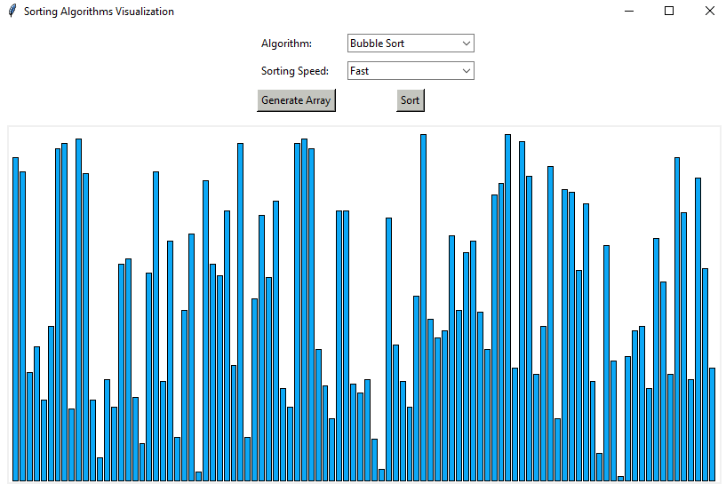

# Sorting Algorithms Visualizer

A python application to visualize various sorting algorithms.

<!-- <table>
  <tr>
    <td></td>
    <td></td>
    <td></td>
  </tr>
</table> -->

## Implemented Algorithms:
* Bubble Sort 
* Merge Sort 
* Quick Sort 
* Heap Sort 

## Built With:
* Python 3.7.7
* Tkinter 8.6

<!-- ## Screenshots: -->
<!-- 

 -->

